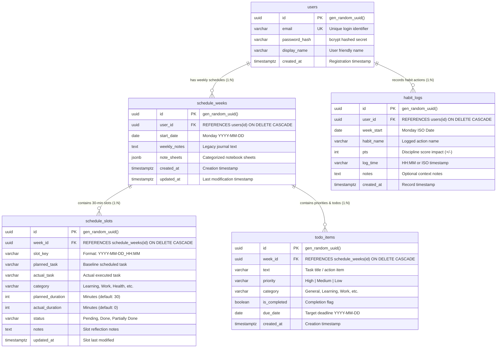

# 🗄️ DayFlow — Database Architecture & Schema Specification

**Target Database:** PostgreSQL 16+ (Docker / AWS Lightsail / Managed DB)  
**Host Port:** `5433` (container port `5432`)  
**Database Name:** `dayflow_db`  
**Primary Schema File:** [`server/src/db/schema.sql`](file:///c:/githubrepo/myrepos/DayFlow/server/src/db/schema.sql)  
**DB Pool & Migration Controller:** [`server/src/db/db.ts`](file:///c:/githubrepo/myrepos/DayFlow/server/src/db/db.ts)

---

## 1. Executive Architecture Overview

DayFlow utilizes a normalized relational PostgreSQL schema centered around **User Authentication** and **Weekly Schedule Containers**. 

### Core Design Principles
1. **Per-User Isolation**: Every weekly container, habit entry, and schedule slot belongs directly or indirectly to an authenticated user (`user_id`).
2. **UUID Primary Keys**: Every table uses PostgreSQL's native `UUID` with `gen_random_uuid()` for distributed, collision-free identification.
3. **Cascade Deletes**: All child tables (`schedule_weeks`, `schedule_slots`, `todo_items`, `habit_logs`) define `ON DELETE CASCADE`. Deleting a user or week cleanly removes all associated slots and entries.
4. **Hybrid Relational + Document Model**: High-frequency tabular data (slots, todos, habits) are modeled as strict relational rows, while flexible multi-tab notebooks leverage PostgreSQL's native `JSONB` format (`schedule_weeks.note_sheets`).
5. **Idempotent Boot Migrations**: The backend database connection automatically runs non-destructive `ALTER TABLE ... ADD COLUMN IF NOT EXISTS` checks on server boot, ensuring zero manual DB intervention during rolling updates.

---

## 2. Entity-Relationship (ER) Diagram



---

## 3. Data Dictionary & Table Specifications

### 3.1. `users` Table
Stores authenticated user accounts, encrypted password hashes, and profile display names.

| Column | Data Type | Nullable | Default | Constraints | Description |
| :--- | :--- | :---: | :--- | :--- | :--- |
| `id` | `UUID` | **NO** | `gen_random_uuid()` | `PRIMARY KEY` | Unique identifier for the user account |
| `email` | `VARCHAR(255)` | **NO** | — | `UNIQUE` | Lowercase email used for JWT authentication |
| `password_hash` | `VARCHAR(255)` | **NO** | — | — | Secure `bcrypt` hashed password string |
| `display_name` | `VARCHAR(100)` | **YES** | `NULL` | — | Friendly greeting name displayed in UI header |
| `created_at` | `TIMESTAMPTZ` | **YES** | `CURRENT_TIMESTAMP` | — | Account registration timestamp |

---

### 3.2. `schedule_weeks` Table
Acts as the central parent container for all 30-minute slots, categorized note sheets, and weekly priorities for a specific Monday-to-Sunday cycle.

| Column | Data Type | Nullable | Default | Constraints | Description |
| :--- | :--- | :---: | :--- | :--- | :--- |
| `id` | `UUID` | **NO** | `gen_random_uuid()` | `PRIMARY KEY` | Unique identifier for the week record |
| `user_id` | `UUID` | **YES** | `NULL` | `FOREIGN KEY` → `users(id)` `ON DELETE CASCADE` | Owner user ID |
| `start_date` | `DATE` | **NO** | — | `UNIQUE(user_id, start_date)`<br>`CHECK (start_date BETWEEN '1800-01-01' AND '2200-12-31')` | Calendar date of Monday (`YYYY-MM-DD`), bounded between 1800 and 2200 |
| `weekly_notes` | `TEXT` | **YES** | `NULL` | — | Plaintext markdown journal content (synced with default sheet) |
| `note_sheets` | `JSONB` | **YES** | `'[]'::jsonb` | — | Dynamic array of multi-sheet notebook objects |
| `created_at` | `TIMESTAMPTZ` | **YES** | `CURRENT_TIMESTAMP` | — | Timestamp when week was first initialized |
| `updated_at` | `TIMESTAMPTZ` | **YES** | `CURRENT_TIMESTAMP` | — | Timestamp when week was last saved/updated |

> [!NOTE]
> **Composite Constraint**: `CONSTRAINT unique_user_week UNIQUE(user_id, start_date)` prevents duplicate week containers for the same user, enabling atomic `ON CONFLICT (user_id, start_date) DO UPDATE` queries.

---

### 3.3. `schedule_slots` Table
Stores granular 30-minute schedule blocks across the 7-day grid cycle, enforcing DayFlow's signature **Planned vs. Actual** time-blocking mechanics.

| Column | Data Type | Nullable | Default | Constraints | Description |
| :--- | :--- | :---: | :--- | :--- | :--- |
| `id` | `UUID` | **NO** | `gen_random_uuid()` | `PRIMARY KEY` | Unique identifier for the slot record |
| `week_id` | `UUID` | **YES** | `NULL` | `FOREIGN KEY` → `schedule_weeks(id)` `ON DELETE CASCADE` | Parent schedule week reference |
| `slot_key` | `VARCHAR(50)` | **NO** | — | `UNIQUE(week_id, slot_key)` | Composite key formatted as `YYYY-MM-DD_HH:MM` |
| `planned_task` | `VARCHAR(255)` | **NO** | `''` | — | Scheduled baseline commitment (time-locked post expiry) |
| `actual_task` | `VARCHAR(255)` | **NO** | `''` | — | Task actually performed (always editable post-completion) |
| `category` | `VARCHAR(50)` | **NO** | `'General'` | — | Activity category (*Learning, Work, Health, Family, etc.*) |
| `planned_duration` | `INT` | **YES** | `30` | — | Baseline planned duration in minutes |
| `actual_duration` | `INT` | **YES** | `0` | — | Real execution duration logged in minutes |
| `status` | `VARCHAR(20)` | **YES** | `'Pending'` | — | Completion state: `'Pending'`, `'Done'`, `'Partially Done'`, `'Not Done'` |
| `notes` | `TEXT` | **YES** | `NULL` | — | Contextual notes or reflection for this specific slot |
| `updated_at` | `TIMESTAMPTZ` | **YES** | `CURRENT_TIMESTAMP` | — | Slot last updated timestamp |

> [!TIP]
> **Fast Slot Lookups**: The composite constraint `CONSTRAINT unique_week_slot UNIQUE(week_id, slot_key)` acts as a unique B-Tree index, ensuring constant-time ($O(1)$) upserts during rapid drag-and-drop or slot saves.

---

### 3.4. `habit_logs` Table
Maintains a tamper-evident, append-only discipline ledger for daily habits, meals, routines, and non-working hour actions.

| Column | Data Type | Nullable | Default | Constraints | Description |
| :--- | :--- | :---: | :--- | :--- | :--- |
| `id` | `UUID` | **NO** | `gen_random_uuid()` | `PRIMARY KEY` | Unique log entry identifier |
| `user_id` | `UUID` | **YES** | `NULL` | `FOREIGN KEY` → `users(id)` `ON DELETE CASCADE` | Owner user ID |
| `week_start` | `DATE` | **NO** | — | `CHECK (week_start BETWEEN '1800-01-01' AND '2200-12-31')` | Monday calendar date representing the week context, bounded between 1800 and 2200 |
| `habit_name` | `VARCHAR(255)` | **NO** | — | — | Name of habit logged (*e.g. "Morning Hydration", "Deep Work 1hr"*) |
| `pts` | `INT` | **YES** | `5` | — | Discipline points impact (positive or penalty score) |
| `log_time` | `VARCHAR(20)` | **NO** | — | — | Time or timestamp of execution (*e.g. "07:30" or ISO*) |
| `notes` | `TEXT` | **YES** | `NULL` | — | Optional execution notes |
| `created_at` | `TIMESTAMPTZ` | **YES** | `CURRENT_TIMESTAMP` | — | Record creation timestamp |

---

### 3.5. `todo_items` Table
Stores actionable priority checklists with priority tags, categories, target due dates, and timeblocking links.

| Column | Data Type | Nullable | Default | Constraints | Description |
| :--- | :--- | :---: | :--- | :--- | :--- |
| `id` | `UUID` | **NO** | `gen_random_uuid()` | `PRIMARY KEY` | Unique todo identifier |
| `week_id` | `UUID` | **YES** | `NULL` | `FOREIGN KEY` → `schedule_weeks(id)` `ON DELETE CASCADE` | Parent schedule week reference |
| `text` | `VARCHAR(255)` | **NO** | — | — | Goal or task title |
| `priority` | `VARCHAR(20)` | **YES** | `'Medium'` | — | Importance level: `'High'`, `'Medium'`, `'Low'` |
| `category` | `VARCHAR(50)` | **YES** | `'General'` | — | Focus category matching schedule grid |
| `is_completed` | `BOOLEAN` | **YES** | `FALSE` | — | Completion checkbox status (`true` / `false`) |
| `due_date` | `DATE` | **YES** | `NULL` | `CHECK (due_date IS NULL OR (due_date BETWEEN '1800-01-01' AND '2200-12-31'))` | Specific target deadline date (`YYYY-MM-DD`), bounded between 1800 and 2200 |
| `created_at` | `TIMESTAMPTZ` | **YES** | `CURRENT_TIMESTAMP` | — | Timestamp when todo was added |

---

## 4. JSONB Document Schema: `note_sheets`

In `schedule_weeks`, the `note_sheets` column stores an extensible array of categorized notebook sheets. Each sheet item conforms to the following schema:

```json
[
  {
    "id": "journal",
    "title": "Weekly Journal",
    "icon": "📓",
    "content": "## Monday Reflections\nFocused on PostgreSQL schema architecture...",
    "isDefault": true
  },
  {
    "id": "tech",
    "title": "Tech & Architecture",
    "icon": "💻",
    "content": "```sql\nSELECT * FROM schedule_slots;\n```",
    "isDefault": true
  },
  {
    "id": "backlog",
    "title": "Sprint Backlog",
    "icon": "💼",
    "content": "- [x] Implement Phase 6 Due Dates\n- [ ] Production Deployment",
    "isDefault": true
  },
  {
    "id": "scratchpad",
    "title": "Quick Scratchpad",
    "icon": "⚡",
    "content": "Temporary scratchpad notes and thoughts...",
    "isDefault": true
  },
  {
    "id": "sheet_1723456789",
    "title": "API Contracts",
    "icon": "🚀",
    "content": "Notes on REST endpoints...",
    "isDefault": false
  }
]
```

### JSON Schema Attributes
- `id` (`string`, required): Unique slug or timestamp-based ID for tab selection.
- `title` (`string`, required): Human-readable tab label (max 30 chars).
- `icon` (`string`, required): Visual emoji icon.
- `content` (`string`, optional): Markdown-formatted body text.
- `isDefault` (`boolean`, optional): `true` for the 4 core preset sheets; `false` for user-created sheets (which display a themed delete button).

---

## 5. Relational Integrity & Cascade Strategy

All inter-table relationships enforce strict foreign key constraints with `ON DELETE CASCADE`:

```
users (1)
 ├── schedule_weeks (N) [ON DELETE CASCADE]
 │    ├── schedule_slots (N) [ON DELETE CASCADE]
 │    └── todo_items (N)     [ON DELETE CASCADE]
 └── habit_logs (N)     [ON DELETE CASCADE]
```

### Operational Scenarios:
1. **User Account Deletion**: Deleting a record from `users` cascades through `schedule_weeks`, automatically purging all linked `schedule_slots`, `todo_items`, and all user `habit_logs`. No orphaned records remain.
2. **Weekly Reset / Purge**: Deleting a `schedule_weeks` row cleanly removes all its 30-minute slots and todo items without affecting the user's account or historical habit logs.
3. **Slot Conflicts & Idempotent Saves**: `schedule_slots` utilizes `slot_key` (e.g. `2026-09-07_09:00`) scoped to `week_id`. Attempting to save to an existing slot triggers an `UPDATE` on the existing row rather than generating duplicates.

---

## 6. Date Sanity Boundaries (1800 to 2200 Calendar Window)

To support long-term multi-generational life planning (100+ years into the future or historical backfilling) while strictly preventing accidental user keyboard typos (e.g. typing `20260` instead of `2026`), DayFlow enforces a robust **400-year valid date window** across all layers:

- **Database Layer**:
  - `check_schedule_weeks_date_range`: `CHECK (start_date BETWEEN '1800-01-01' AND '2200-12-31')`
  - `check_habit_logs_date_range`: `CHECK (week_start BETWEEN '1800-01-01' AND '2200-12-31')`
  - `check_todo_items_date_range`: `CHECK (due_date IS NULL OR (due_date BETWEEN '1800-01-01' AND '2200-12-31'))`
- **Backend API Layer**:
  - Validates `weekStart`, `dueDate`, and `logTime` using `isValidDateRange` in `server/src/utils/dateValidation.ts`, rejecting out-of-range dates with `HTTP 400 Bad Request`.
- **Frontend Client Layer**:
  - HTML date pickers enforce `min="1800-01-01" max="2200-12-31"`.
  - Date navigator clamps or blocks out-of-range navigation with user-friendly feedback.

---

## 7. Migration History & Evolution Log

| Phase | Milestone / Date | Schema Migration Alteration | Affected Table | Description |
| :---: | :---: | :--- | :--- | :--- |
| **V1** | Initial Release | Core tables creation (`users`, `schedule_weeks`, `schedule_slots`, `habit_logs`, `todo_items`) | All | Initial baseline database setup |
| **Phase 1** | August 2026 | `ALTER TABLE todo_items ADD COLUMN priority`, `category` | `todo_items` | Added High/Med/Low priorities and category badges |
| **Phase 5** | August 2026 | `ALTER TABLE schedule_weeks ADD COLUMN IF NOT EXISTS note_sheets JSONB DEFAULT '[]'::jsonb;` | `schedule_weeks` | Added multiple categorized markdown notebook sheets |
| **Phase 6** | September 2026 | `ALTER TABLE todo_items ADD COLUMN IF NOT EXISTS due_date DATE;` | `todo_items` | Added target due dates and day/week granularity synchronization |
| **Sanity Boundaries** | September 2026 | Added `CHECK` constraints on `schedule_weeks`, `habit_logs`, and `todo_items` (`1800-01-01` to `2200-12-31`) | `schedule_weeks`, `habit_logs`, `todo_items` | Enforced 400-year date validation across DB, API, and UI |

---

*Document maintained within the DayFlow core repository (`docs/DATABASE_SCHEMA.md`).*
